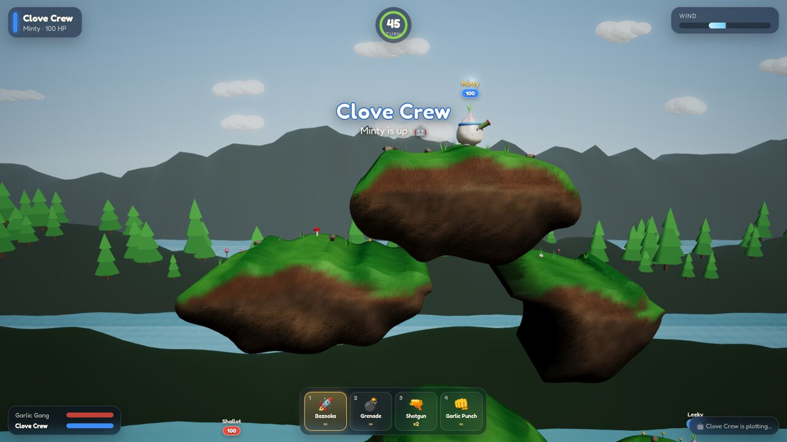

# 🧄 Allium Assault

[](https://github.com/marcelpetrick/AlliumAssault/actions/workflows/ci.yml)
[](https://github.com/marcelpetrick/AlliumAssault/releases/latest)
[](LICENSE)

### ▶ [Play Allium Assault in your browser](https://marcelpetrick.github.io/AlliumAssault/)

No install, no account: open **https://marcelpetrick.github.io/AlliumAssault/** in a desktop
browser and start a Quick Match.

<p align="center">
  
</p>

<table>
  <tr>
    <td width="50%"></td>
    <td width="50%"></td>
  </tr>
</table>

A turn-based 3D artillery game in the spirit of **Worms Armageddon**, starring teams of cute
garlic buddies. Destructible islands, wind, fifteen weapons from bazookas and banana bombs to
flying sheep and a concrete mule, random crates — rendered with real-time 3D graphics in your
browser.

**Download:** grab the ready-to-host web build from the [latest release](https://github.com/marcelpetrick/AlliumAssault/releases/latest),
unzip it and serve the folder with any static web server (e.g. `npx serve`).

**Author:** Marcel Petrick <mail@marcelpetrick.it> · **License:** GPL-3.0-or-later · Built with AI assistance.

## Play

Online: **https://marcelpetrick.github.io/AlliumAssault/** (updated with every release).

Locally:

```bash
npm install
npm run dev          # http://localhost:5173
```

Production build (static files, no backend): `npm run build`, then serve `dist/` with any static
file server, e.g. `npm run preview`.

Append `?quality=low` to the URL on weak GPUs (disables shadows, bloom and MSAA).

## Features

- **Smooth 3D world** — Babylon.js 9: rounded terrain slabs, cascaded soft shadows, bloom, ACES
  tone mapping, animated water, parallax hills with forests, drifting clouds, particle explosions.
- **Destructible terrain** — every explosion carves a round, scorched crater; props on the ground
  get blown away.
- **Worms-style rules** — 2–4 teams of 1–4 buddies, rotating turns, turn timer, 5 s retreat,
  wind, knockback, fall damage, drowning, death explosions, last team standing wins.
- **Random crates** — from the second turn on, crates teleport onto free land: health crates heal
  25 HP, weapon crates add one more of a special weapon. Off / Normal / Lots in the setup.
- **Arsenal setting** — start with every weapon, or find the special weapons (cluster bomb, sheep,
  air strike, self-destruct, minigun, holy grenade, banana bomb, flying sheep, concrete mule) in
  crates only.
- **Hot-seat and AI** — mix human and AI teams freely; AI (easy / normal / hard) simulates real
  trajectories to find its shots.
- **Three sceneries** — Garlic Meadow, Golden Sunset, Moonlit Grove; seeded maps you can share.
- **Synthesized sound** — all effects generated with Web Audio, no asset files.

## Controls

| Key | Action |
|---|---|
| ← → | Walk |
| Enter | Jump forward |
| Backspace | Back-flip (high jump) |
| ↑ ↓ | Aim |
| Space | Hold to charge, release to fire (punch and shotgun fire instantly); sheep: release, then detonate |
| 1–9, 0, Shift+1–5 / Tab | Choose weapon (or click it in the weapon bar) |
| Mouse wheel / drag | Zoom / pan camera |
| Click | Call the air strike or drop the concrete mule onto that spot |
| M / Esc | Mute / pause menu |

## Weapons

| Weapon | Ammo | Behaviour |
|---|---|---|
| 🚀 Bazooka | ∞ | Charged shot, strong wind drift, explodes on contact (50 dmg) |
| 💣 Grenade | ∞ | Charged throw, bounces, 3 s fuse, little wind drift (50 dmg) |
| 🔫 Shotgun | 2 | Two instant shots along the aim line (22 dmg each) |
| 👊 Garlic Punch | ∞ | Close-range uppercut that launches the victim (45 dmg) |
| 🧨 Cluster Bomb | 3 | Red grenade, 3 s fuse (25 dmg), bursts into five bomblets of 10 dmg each |
| 🐑 Sheep | 1 | Space releases it, it hops forward in small 45° leaps; Space again detonates it (75 dmg), at the latest after 10 s |
| ✈️ Air Strike | 1 | Click on the map: a plane drops five bombs around that spot (25 dmg each) |
| 🏏 Baseball Bat | 2 | Home run: 25 dmg, knocks the victim far along the aim line (at least 20° upwards) |
| 🔥 Blowtorch | 2 | Walks forward for 3 s burning a level tunnel through rock; falls into gaps, never climbs (15 dmg) |
| 💥 Self-Destruct | 1 | The buddy blows itself up: damage equals its health, blast radius health ÷ 10 |
| 🔩 Minigun | 1 | Burst of 14 bullets (5 dmg each) whose kicks shove the victim far across the map |
| ✨ Holy Garlic Grenade | 1 | Rolls to a stop, sings Hallelujah, then erupts 1.6 s later (100 dmg, radius 7) |
| 🍌 Banana Bomb | 1 | 3 s fuse (40 dmg), then five bouncing bananas explode one after another (30 dmg each) |
| 🦸 Flying Sheep | 1 | Takes off along the aim; the arrow keys steer it the whole flight, Space detonates (75 dmg); explodes on impact or after 15 s |
| 🫏 Concrete Mule | 1 | Click on the map: it drops from the sky and explodes on up to six impacts as it smashes downwards (35 dmg each) |

## Architecture

```
src/
├── core/     Pure TypeScript game rules — no Babylon, no DOM, fully unit-tested
│   ├── terrain.ts   density field, seeded generation, craters, spawn finding
│   ├── contour.ts   marching squares (fill triangles + oriented edges)
│   ├── physics.ts   circle bodies vs. field, swept projectiles
│   ├── weapons.ts   weapon table (15 weapons by kind), hotkey mapping
│   ├── game.ts      match state machine, turns, weapon execution, damage, crates
│   ├── sheep.ts     hopping sheep · flyer.ts steerable flying sheep
│   ├── strike.ts    air strike and concrete mule drop planning
│   ├── crates.ts    seeded crate contents and spots
│   └── ai.ts        trajectory-search AI driving the same commands as players
├── render/   Babylon.js presentation: terrain mesh, buddies, environment, effects, camera
├── ui/       HTML/CSS overlay: title, match setup, HUD, pause, victory
├── audio.ts  Web Audio synthesizer
└── app.ts    engine, fixed 60 Hz loop, input, wiring
```

Terrain is a scalar field sampled every 0.25 units: positive values are rock and approximate the
distance to the surface. Physics queries the field directly (smooth normals, no tunnelling),
explosions subtract discs from it, and the renderer rebuilds only dirty 8×8-unit chunks by
extruding the marching-squares contour into a bevelled 3D slab.

Design documents: [`docs/ARCHITECTURE.md`](docs/ARCHITECTURE.md) (C4 model with Mermaid diagrams),
[`docs/VISION.md`](docs/VISION.md), [`docs/PLAN.md`](docs/PLAN.md); the original
research session is archived in [`docs/archive/`](docs/archive/).

## Testing

```bash
npm run typecheck    # TypeScript strict
npm test             # Vitest: terrain, contour, physics, match rules, AI (incl. full AI match)
npm run e2e          # Playwright in Google Chrome: menus, human turns, every weapon, crates, sounds
npm run verify       # all of the above plus production build
```

The page exposes `window.__allium` (`state()`, `startMatch()`, `fastForward()`) for automated tests.

Continuous integration runs lint, typecheck, unit tests, build and the Chrome E2E suite on every
push. Pushing a `v*` tag builds and publishes a GitHub release with the zipped static site and
deploys the game to GitHub Pages: <https://marcelpetrick.github.io/AlliumAssault/>.

## Versioning

The project follows [Semantic Versioning](https://semver.org/). Every commit on `master` carries
its own version: bump `package.json` (patch for fixes, docs and dependency updates; minor for
features; major for breaking changes) and add a matching entry to [`CHANGELOG.md`](CHANGELOG.md).
Commits are not tagged individually: a `vX.Y.Z` tag is created only for a release, and pushing it
publishes a GitHub release with the web build. Contributor and agent rules are in
[`AGENTS.md`](AGENTS.md).

## More screenshots

| Title screen | Floating islands |
|---|---|
|  |  |

## History

Version 1 replaced two earlier 2D prototypes with this 3D rewrite. See [`CHANGELOG.md`](CHANGELOG.md)
for the release history.

Game mechanics are inspired by Team17's Worms series; all design, art, sound and code are original.
