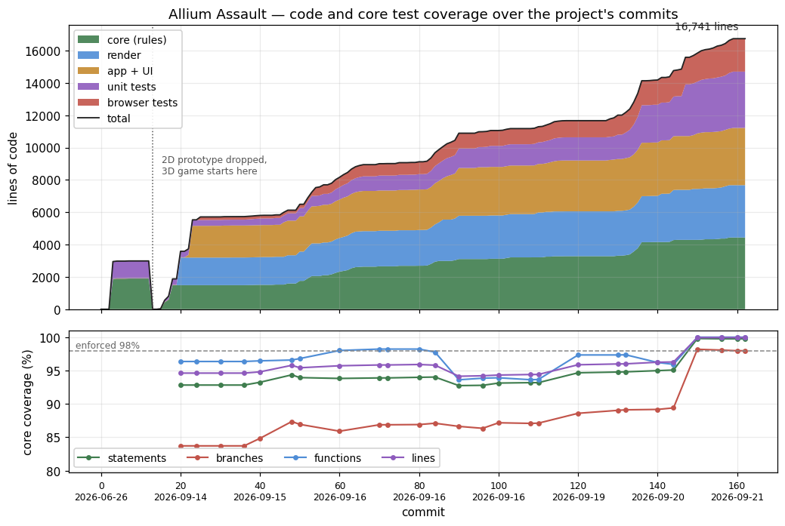

# 🧄 Allium Assault

[](https://marcelpetrick.github.io/AlliumAssault/)
[](https://github.com/marcelpetrick/AlliumAssault/actions/workflows/ci.yml)
[](https://github.com/marcelpetrick/AlliumAssault/actions/workflows/pages.yml)
[](https://github.com/marcelpetrick/AlliumAssault/releases/latest)
[](LICENSE)
[](https://reuse.software/)
[](https://www.babylonjs.com/)
[](https://www.typescriptlang.org/)
[](https://vite.dev/)
[](https://vitest.dev/)
[](https://playwright.dev/)
[](https://nodejs.org/)

## ▶ [Play Allium Assault in your browser](https://marcelpetrick.github.io/AlliumAssault/)

No install, no account: open **<https://marcelpetrick.github.io/AlliumAssault/>** in a desktop
browser and start a Quick Match.

<p align="center">
  
</p>

<table>
  <tr>
    <td width="50%"></td>
    <td width="50%"></td>
  </tr>
  <tr>
    <td width="50%"></td>
    <td width="50%"></td>
  </tr>
</table>

A turn-based 3D artillery game in the spirit of **Worms Armageddon**, starring teams of cute
garlic buddies. Destructible islands, wind, twenty-two weapons from bazookas and banana bombs to
a steerable flying sheep, a concrete mule and a napalm strike, random crates, comic tombstones,
Sudden Death and five sceneries — rendered with real-time 3D graphics in your browser.

**Status: almost feature complete.** Everything on the vision list is in and playable; what is
left is polish, balance and the odd extra weapon.

**Download:** grab the ready-to-host web build from the [latest release](https://github.com/marcelpetrick/AlliumAssault/releases/latest),
unzip it and serve the folder with any static web server (e.g. `npx serve`).

**Author:** Marcel Petrick <mail@marcelpetrick.it> · **License:** GPL-3.0-or-later · Built with AI assistance.

## Play

Online: **<https://marcelpetrick.github.io/AlliumAssault/>** (updated with every release).

Locally:

```bash
npm install
npm run dev          # http://localhost:5173
```

Production build (static files, no backend): `npm run build`, then serve `dist/` with any static
file server, e.g. `npm run preview`.

On a weak GPU, switch **Graphics** to Low in the setup screen; `?quality=low` in the URL does the
same before the menu is even reachable. Either way the shadow cascade, bloom and MSAA are off and
the pixel density is halved.

## Features

- **Smooth 3D world** — Babylon.js 9: rounded terrain slabs, cascaded soft shadows, bloom, ACES
  tone mapping, animated water, parallax hills with forests, drifting clouds, particle explosions.
- **Destructible terrain** — every explosion carves a round, scorched crater and throws tumbling
  lumps of earth out of it; props on the ground
  get blown away.
- **Worms-style rules** — 2–4 teams of 1–4 buddies, rotating turns, turn timer, 5 s retreat,
  wind, knockback, fall damage, drowning, death explosions, last team standing wins.
- **Rope** — shoot a hook into rock, then hang, reel up and down, swing, let go with your momentum
  and hook on again in mid-air. It bends around corners it has to pass and lets go if the rock it
  bit into is blasted away. Roping does not use up the turn's shot: land, then fire.
- **Proximity mines** — laid at the buddy's feet, they arm while you run and then stay on the map
  through every turn until somebody walks into them. Rock between a mine and a buddy shields it, and
  a blast sets mines off in a chain.
- **Random crates** — from the second turn on, crates teleport onto free land: health crates heal
  25 HP, weapon crates add one more of a special weapon. Off / Normal / Lots / Cratyness (two fresh
  crates every single turn, up to eight on the map) in the setup. A hopping
  sheep or a Super Sheep that runs over a crate collects it for the buddy that launched it, without
  going off.
- **Arsenal setting** — start with every weapon, find the special weapons (sheep, air strike,
  self-destruct, minigun, holy grenade, banana bomb, flying sheep, concrete mule, napalm strike)
  in crates only, or play with infinite supplies of everything. The basic weapons — bazooka,
  grenade, shotgun, garlic punch, cluster bomb, baseball bat, blowtorch, drill, rope and platform
  — are always in the loadout from turn one.
- **Sudden Death** — from the setup screen, pick the turn (10, 20 or 30, or off) on which every
  living buddy drops to 1 HP. From the next turn on the water climbs a world unit at the start of
  every turn — the camera shows it rising — flooding caves and low ground. Nobody dies from the
  strike itself, but a hit or the rising water finishes the match, and a buddy the water takes
  before it can act hands the turn straight on.
- **Tombstones** — fallen buddies leave a comic R.I.P. tombstone with their name that explosions
  knock around.
- **Hot-seat and AI** — mix human and AI teams freely; AI (easy / normal / hard) simulates real
  trajectories to find its shots.
- **Five sceneries** — Garlic Meadow, Golden Sunset, Moonlit Grove, Candy Shop (lollipop trees,
  gumdrops, strawberry-milk sea) and Frosty Peaks (snowy pines, ice); seeded maps you can share.
- **Gravity** — Moon, Normal (the usual world) or Heavy, chosen in the setup screen: lighter
  gravity means floaty jumps, long throws and gentle landings, heavier gravity the opposite. The
  HUD shows the pull whenever it is not the ordinary one.
- **Map preview** — the setup screen draws the island the current seed produces, in the colours of
  the chosen scenery, so you can roll the dice until you like the map before starting.
- **Comfortable setup** — text size Normal / Large / Huge, a Graphics budget (Full or Low, for
  weak GPUs), and the last match settings are remembered in the browser for the next game (Reset
  all restores the defaults).
- **Synthesized sound** — every effect generated with Web Audio, no asset files: charge whoosh,
  whistling rockets, bleating sheep, a propeller plane, crackling napalm, footsteps and more —
  every action has its own voice, written down in [docs/SOUND.md](docs/SOUND.md).
- **About screen** — author, tech stack with versions and open-source licenses.

## Controls

| Key                        | Action                                                                                            |
| -------------------------- | ------------------------------------------------------------------------------------------------- |
| ← →                        | Walk                                                                                              |
| Enter                      | Jump forward                                                                                      |
| Backspace                  | Back-flip (high jump)                                                                             |
| ↑ ↓                        | Aim                                                                                               |
| Space                      | Hold to charge, release to fire (punch and shotgun fire instantly); sheep: release, then detonate |
| 1–9, 0, Shift+1–0, T / Tab | Choose weapon (or click it in the weapon bar)                                                     |
| Mouse wheel / drag         | Zoom / pan camera; the wheel tilts a platform while one is being placed                           |
| Click                      | Call a strike, drop the concrete mule, set a platform or teleport to that spot                    |
| ← → (air/napalm strike)    | Choose the side the plane flies in from; the buddy stays put while choosing                       |
| ↑ ↓ ← → (on the rope)      | Reel in and out, swing left and right                                                             |
| Arrow keys (flying sheep)  | Steer the flying sheep towards that direction                                                     |
| M / Esc                    | Mute / pause menu (Esc also closes help and about); the HUD's Help and Pause buttons do the same  |

## Weapons

Grouped the way the weapon bar groups them: the launcher and the thrown family, the guns, the
fists, the sheep, what is called in from the sky, the digging tools, getting about and building,
and the two ways of taking others with you.

| Key | Weapon                 | Ammo | Behaviour                                                                                                                                   |
| --- | ---------------------- | ---- | ------------------------------------------------------------------------------------------------------------------------------------------- |
| 1   | 🚀 Bazooka             | ∞    | Charged shot, strong wind drift, explodes on contact (50 dmg)                                                                               |
| 2   | 💣 Grenade             | ∞    | Charged throw, bounces, 3 s fuse, little wind drift (50 dmg)                                                                                |
| 3   | 🧨 Cluster Bomb        | 3    | Red grenade, 3 s fuse (25 dmg), bursts into five bomblets of 10 dmg each                                                                    |
| 4   | 🍌 Banana Bomb         | 1    | 3 s fuse (40 dmg), then five bouncing bananas explode one after another (30 dmg each)                                                       |
| 5   | ✨ Holy Garlic Grenade | 1    | Rolls to a stop, sings Hallelujah, then erupts 1.6 s later (100 dmg, radius 7)                                                              |
| 6   | 💥 Shotgun             | 2    | Two instant shots along the aim line (22 dmg each)                                                                                          |
| 7   | 🔫 Minigun             | 1    | Burst of 14 bullets (5 dmg each) whose kicks shove the victim far across the map                                                            |
| 8   | 👊 Garlic Punch        | ∞    | Close-range uppercut that launches the victim (45 dmg)                                                                                      |
| 9   | 🏏 Baseball Bat        | 2    | Home run: 25 dmg, knocks the victim far along the aim line (at least 20° upwards)                                                           |
| 0   | 🐑 Sheep               | 1    | Space releases it, it hops forward in small 45° leaps; Space again detonates it (75 dmg), at the latest after 10 s                          |
| ⇧1  | 🦸 Flying Sheep        | 1    | Takes off along the aim; the arrow keys steer it the whole flight, Space detonates (75 dmg); explodes on impact or after 15 s               |
| ⇧2  | ✈️ Air Strike          | 1    | Click on the map: a plane drops five bombs around that spot (25 dmg each)                                                                   |
| ⇧3  | 🌋 Napalm Strike       | 1    | Click on the map: a plane drops napalm the wind carries far; the ground burns about 9 s, eats a dent into itself, hops buddies for 3 dmg    |
| ⇧4  | 🫏 Concrete Mule       | 1    | Click on the map: it drops from the sky and explodes on up to six impacts as it smashes downwards (35 dmg each)                             |
| ⇧5  | 🔥 Blowtorch           | 2    | Burns a tunnel along the aim line for 3 s and rides it — aim up to climb, down to dig in; falls where the rock ends (15 dmg)                |
| ⇧6  | ⛏️ Drill               | 2    | Drills straight down for 3 s; no fall damage while drilling (15 dmg to buddies in the way)                                                  |
| ⇧7  | 🪝 Rope                | 3    | Space shoots a hook up to 24 units into rock; hang, ↑↓ reel, ←→ swing, Space lets go with your momentum. Land first, then fire a weapon     |
| ⇧8  | 🪵 Platform            | 2    | Move the mouse to place a five-unit board in open air, the wheel tilts it up to 60°, a left click sets it; solid, indestructible, no damage |
| ⇧9  | 🛞 Proximity Mine      | 2    | Space drops it at your feet; it arms after 1.5 s and blows up the first buddy within 2 units — friend, foe or the one who laid it (40 dmg)  |
| ⇧0  | ☠️ Self-Destruct       | 1    | "Oh no!": the buddy panics for three seconds, then blows itself up — damage equals its health, blast radius health ÷ 10                     |
| T   | 🌀 Teleport            | 1    | Press T, then click any free spot: the buddy appears there and falls, lands hard or drowns from there like anybody else. One per match      |
| V   | 🏺 Ming Vase           | 1    | Six hundred years of porcelain, thrown once: an enormous blast and eight razor shards that each hit like a grenade. One per match           |

## Architecture

```text
src/
├── core/     Pure TypeScript game rules — no Babylon, no DOM, fully unit-tested
│   ├── terrain.ts   density field, seeded generation, craters, spawn finding
│   ├── contour.ts   marching squares (fill triangles + oriented edges)
│   ├── physics.ts   circle bodies vs. field, swept projectiles
│   ├── weapons.ts   weapon table (22 weapons by kind), arsenal flags, hotkey mapping
│   ├── match.ts     what a match is made of: config, buddies, teams, phases, turn actions, events
│   ├── game.ts      the state machine over them: turns, weapon execution, damage, crates, mines, flames
│   ├── sheep.ts     hopping sheep · flyer.ts steerable flying sheep
│   ├── strike.ts    air strike, napalm and concrete mule drop planning
│   ├── fire.ts      napalm flames on the ground · crates.ts seeded crate contents and spots
│   ├── mines.ts     proximity mines: arming delay, line of sight, trigger fuse
│   ├── rope.ts      rope: swept hook, length constraint, corner wrapping, swing
│   └── ai.ts        trajectory-search AI driving the same commands as players
├── render/   Babylon.js presentation: terrain mesh, buddies, sceneries, effects, camera
├── ui/       HTML/CSS overlay: title, setup, HUD, help, about, pause, victory; persisted settings
├── audio.ts  Web Audio synthesizer
└── app.ts    engine, fixed 60 Hz loop, input, wiring
bench/        core.bench.ts — what one simulation step costs, stage by stage (npm run profile)
scripts/      SPDX check and fixer, README media capture, README history chart
```

Terrain is a scalar field sampled every 0.25 units: positive values are rock and approximate the
distance to the surface. Physics queries the field directly (smooth normals, no tunnelling),
explosions subtract discs from it, and the renderer rebuilds only dirty 8×8-unit chunks by
extruding the marching-squares contour into a bevelled 3D slab.

Design documents: [`docs/ARCHITECTURE.md`](docs/ARCHITECTURE.md) (C4 model with Mermaid diagrams),
[`docs/VISION.md`](docs/VISION.md), [`docs/PLAN.md`](docs/PLAN.md),
[`docs/PERFORMANCE.md`](docs/PERFORMANCE.md) (what was measured, and what it cost); the original
research session is archived in [`docs/archive/`](docs/archive/).

## Testing

```bash
npm run lint         # type-aware ESLint, Prettier, Stylelint, markdownlint, SPDX headers
npm run typecheck    # TypeScript strict
npm test             # Vitest: terrain, physics, every weapon's rules, crates, mines, the rope, settings, AI
npm run profile      # measure the rules core stage by stage (docs/PERFORMANCE.md)
npm run e2e          # Playwright in Google Chrome: menus, settings, every weapon, crates, tombstones, sceneries, sounds
npm run coverage     # Vitest with v8 coverage of the game rules in src/core; HTML report in coverage/
npm run verify       # all of the above plus production build
```

The page exposes `window.__allium` (`state()`, `startMatch()`, `fastForward()`, `stepFrames()`,
`project()`) for automated tests.

Continuous integration runs all linters, typecheck, unit tests, build and the Chrome E2E suite on
every push, plus a REUSE compliance check and actionlint on the workflows.

```bash
npm run lint:spdx    # every file has SPDX headers or a REUSE.toml annotation
npm run spdx:fix     # add the SPDX header to new files
npm run lint:reuse   # official REUSE tool (needs uv)
```

Pushing a `v*` tag builds and publishes a GitHub release with the zipped static site and
deploys the game to GitHub Pages: <https://marcelpetrick.github.io/AlliumAssault/>.

## Versioning

The project follows [Semantic Versioning](https://semver.org/). Every commit on `master` carries
its own version: bump `package.json` (patch for fixes, docs and dependency updates; minor for
features; major for breaking changes) and add a matching entry to [`CHANGELOG.md`](CHANGELOG.md).
Commits are not tagged individually: a `vX.Y.Z` tag is created only for a release, and pushing it
publishes a GitHub release with the web build. Contributor and agent rules are in
[`AGENTS.md`](AGENTS.md).

## More screenshots

| Title screen                                                   | Napalm strike                                                                 | Tombstone                                                                |
| -------------------------------------------------------------- | ----------------------------------------------------------------------------- | ------------------------------------------------------------------------ |
|  |  |  |

Regenerate all media with `npm run capture-media -- <preview url>` against a running preview build (needs ffmpeg).

## History

Version 1 replaced two earlier 2D prototypes with this 3D rewrite. See [`CHANGELOG.md`](CHANGELOG.md)
for the release history.



Every commit measured straight out of git: the bands are the lines of code in the rules core, the
renderer, the app and UI, the unit tests and the browser tests, and the drop is the day the 2D
prototype was thrown away. Below it, the four Vitest coverage metrics of `src/core`, sampled at
every tenth commit — running the suite at a past commit is not free — against the 98% that is
enforced today.

```bash
python3 scripts/history_chart.py              # redraw; measures the samples it does not know yet
python3 scripts/history_chart.py --no-measure # redraw from the cached measurements only
```

Game mechanics are inspired by Team17's Worms series; all design, art, sound and code are original.
