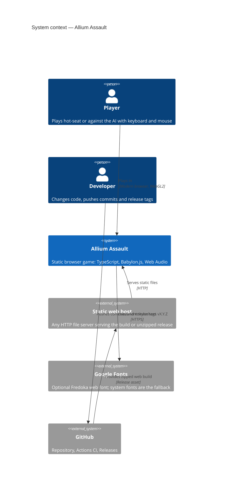
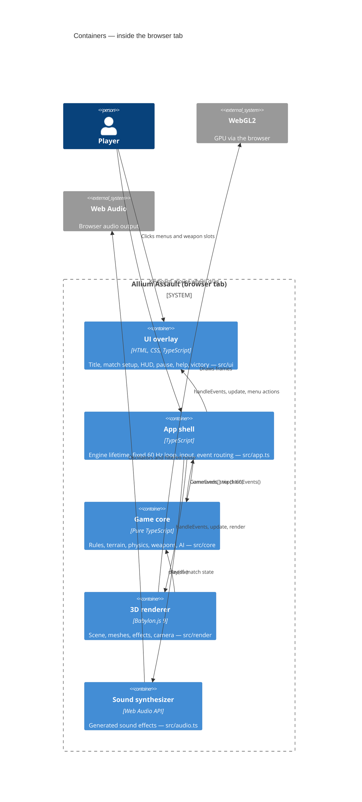
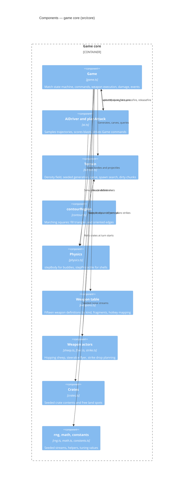
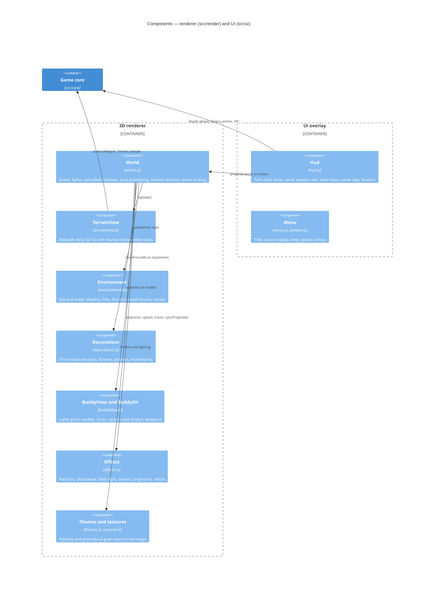
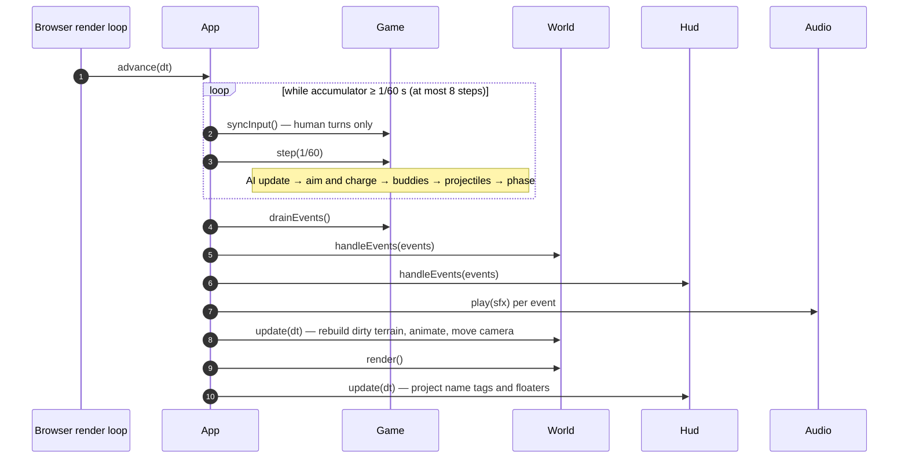
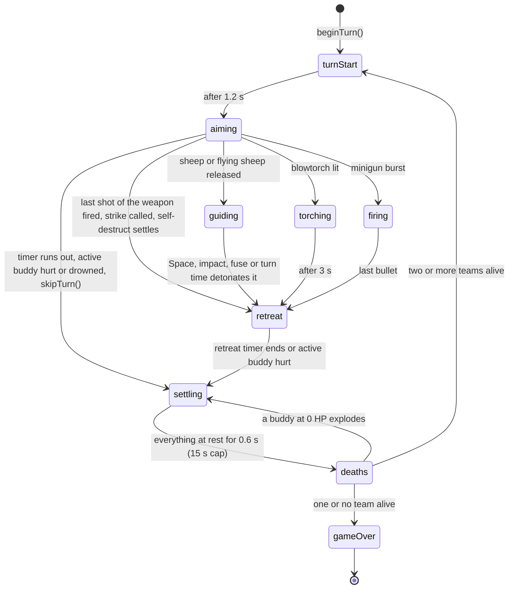
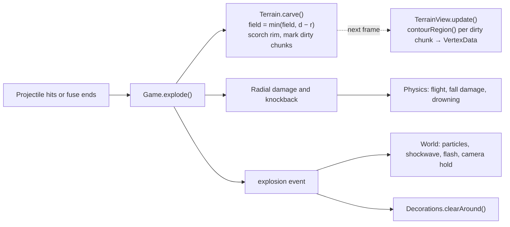
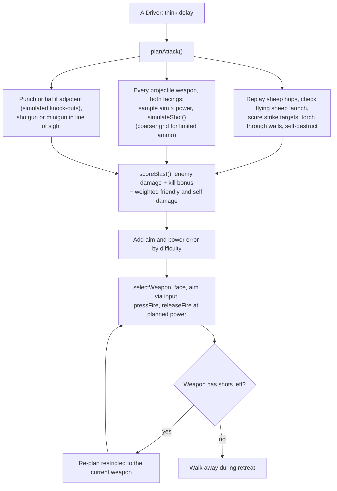
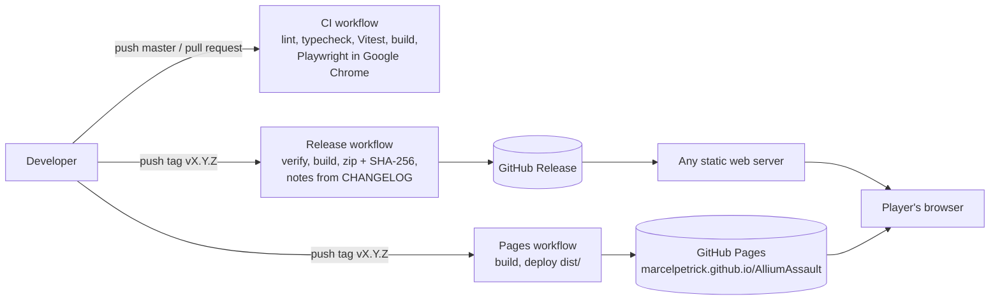

# Allium Assault — Architecture (C4)

This document describes the architecture of Allium Assault using the [C4 model](https://c4model.com/):
system context, containers, components, and the dynamic flows that matter most. Diagrams are
[Mermaid](https://mermaid.js.org/) and render directly on GitHub.

## 1. Goals and constraints

| Goal | Consequence in the design |
|---|---|
| Looks good in 3D, no pixel/voxel art | Babylon.js scene with PBR-style lighting, shadows, post-processing; smooth meshes from a density field |
| Plays like Worms | Explicit match state machine, fixed 60 Hz simulation, arbitrarily destructible terrain |
| Browser only, no backend | Static Vite build; all state lives in the tab (mute flag in `localStorage`) |
| Testable | Rules in a headless core with no Babylon/DOM imports; `window.__allium` hook for Playwright |

## 2. Level 1 — System context

There is no server-side component: once the files are delivered, the game runs entirely in the
player's browser tab.

## 3. Level 2 — Containers

| Container | Path | May import |
|---|---|---|
| Game core | `src/core/` | only other core modules and `simplex-noise` — **no Babylon, no DOM** |
| 3D renderer | `src/render/` | core (read-only), Babylon.js |
| UI overlay | `src/ui/` | core types, render themes, DOM |
| App shell | `src/app.ts`, `src/main.ts` | everything |
| Sound | `src/audio.ts` | Web Audio only |

## 4. Level 3 — Components

### 4.1 Game core

**Terrain model.** A `Float32Array` of 513 × 257 nodes (world 128 × 64 units, one node every
0.25 units). Values above zero are rock and approximate the distance to the surface, clamped to
±4. This single field serves every consumer:

- physics derives smooth collision normals from its gradient,
- explosions subtract a disc with `min(field, distance − radius)`,
- the renderer extracts the surface with marching squares.

**Match state.** `Game` is the only place that mutates match state. Input arrives as commands
(`jump`, `selectWeapon`, `pressFire`, …) or as the held `input` flags; results leave as typed
`GameEvent`s.

### 4.2 Renderer and UI

## 5. Dynamic view — one frame

The simulation runs at a fixed step, independent of the frame rate. `stepFrames(n, dt)` on the
test hook swaps the real-time loop for exact frames, which is how the README GIF was recorded.

## 6. Dynamic view — turn state machine

Rules enforced here:

- ammo is consumed on a weapon's first shot,
- in `guiding`, `torching` and `firing` the buddy cannot move; the turn timer keeps running in
  `guiding` and `torching`,
- crates teleport in at turn starts from a seeded stream, so maps replay identically,
- the turn only ends once the world has settled,
- death explosions are queued one at a time, so chain reactions resolve deterministically.

## 7. Dynamic view — an explosion

## 8. Dynamic view — AI turn

Planning runs on the main thread. With the full arsenal a hard AI decision takes about 35–50 ms
in the Node benchmark, a short hitch once per AI turn (see `review.md`, finding 1). The AI can
also detour to a nearby crate when it has no good shot, and steers flying sheep while guiding.

## 9. Deployment and delivery

Every commit on `master` carries its own SemVer version in `package.json` and a `CHANGELOG.md`
entry; only releases get a `vX.Y.Z` tag. See the Versioning section of the README and `AGENTS.md`.

## 10. Key decisions

| Decision | Alternatives considered | Why |
|---|---|---|
| Custom density-field terrain and physics | Physics engines (Havok, Box2D, Planck) | General engines handle arbitrarily destructible terrain poorly; one field keeps physics and rendering consistent |
| Babylon.js | Three.js, Phaser, Unity WebGL | Complete engine (shadows, post-processing, particles, glow) with a small integration surface; 3D was a hard requirement |
| Gameplay on a 2D plane, rendered in 3D | Full 3D gameplay | Keeps Worms-style aiming and tactics while the presentation is fully 3D |
| HTML/CSS overlay for UI | Babylon GUI | Crisp text, standard layout and styling, easy Playwright selectors |
| Events out of the core | Renderer polling diffs | Effects, sound and HUD react to exactly what happened, in order |
| Synthesized audio | Sample files | No asset pipeline or licensing; tiny build |

## 11. Quality and testing map

| Level | Tooling | Covers |
|---|---|---|
| Unit | Vitest (`tests/`) | RNG, terrain generation, craters, contouring, body and projectile physics, turns, weapons, deaths, AI plans, a full AI-vs-AI match |
| End-to-end | Playwright + Google Chrome (`e2e/`) | Title demo, a human turn with real keys, AI match to victory, custom setup, pause menu; every weapon with real keys and clicks (`weapons.spec.ts`); crates, audio cues, movement sounds and weapon bar (`features.spec.ts`) — sounds are checked through the synthesizer's play counters |
| Static | ESLint, TypeScript strict | Whole codebase |
| Pipeline | `npm run verify`, GitHub Actions | All of the above on every push; releases and GitHub Pages deployment on tags |
