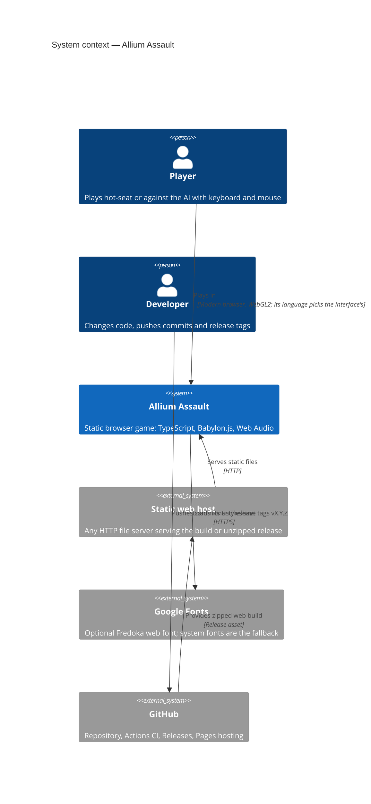
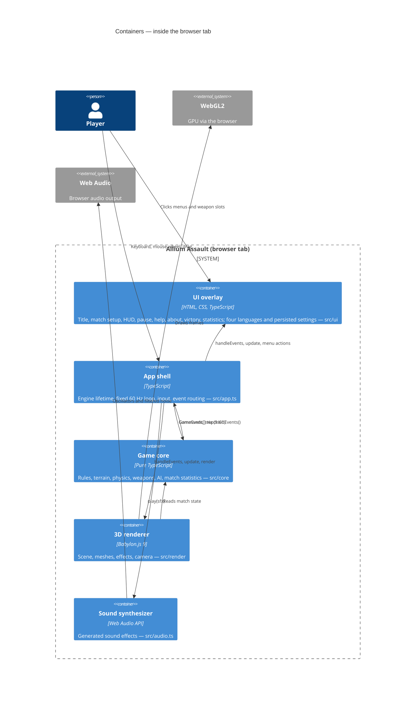
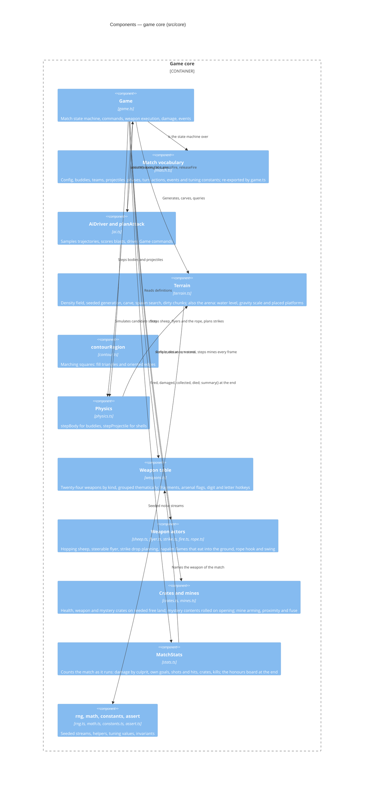
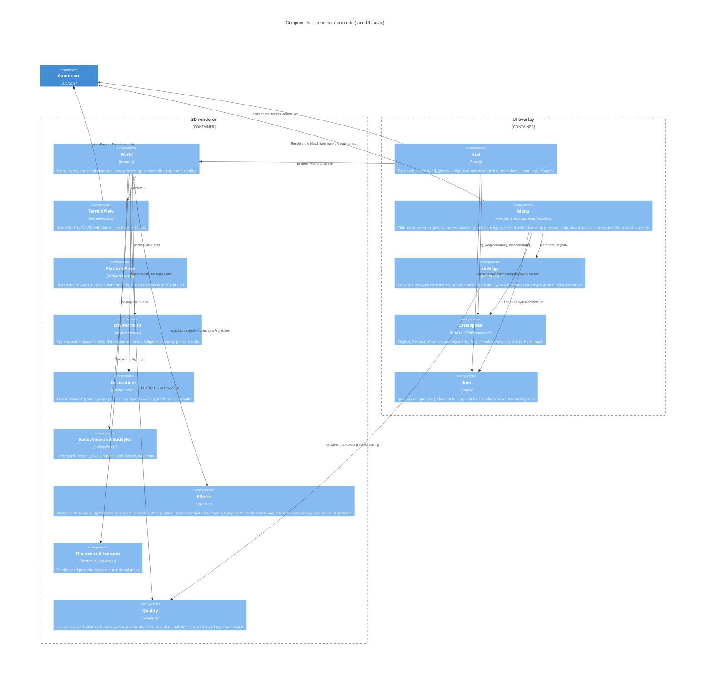
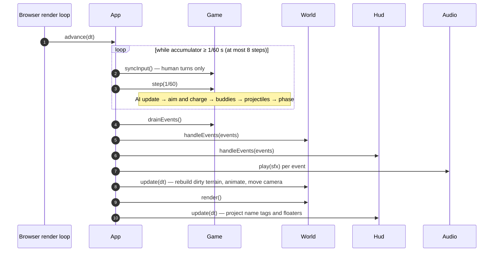
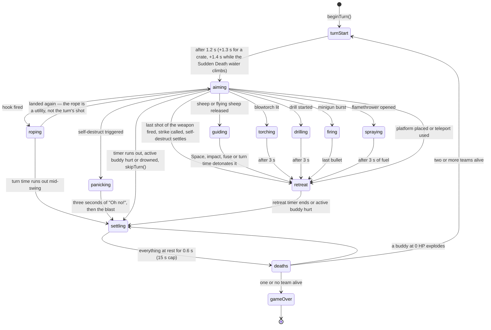
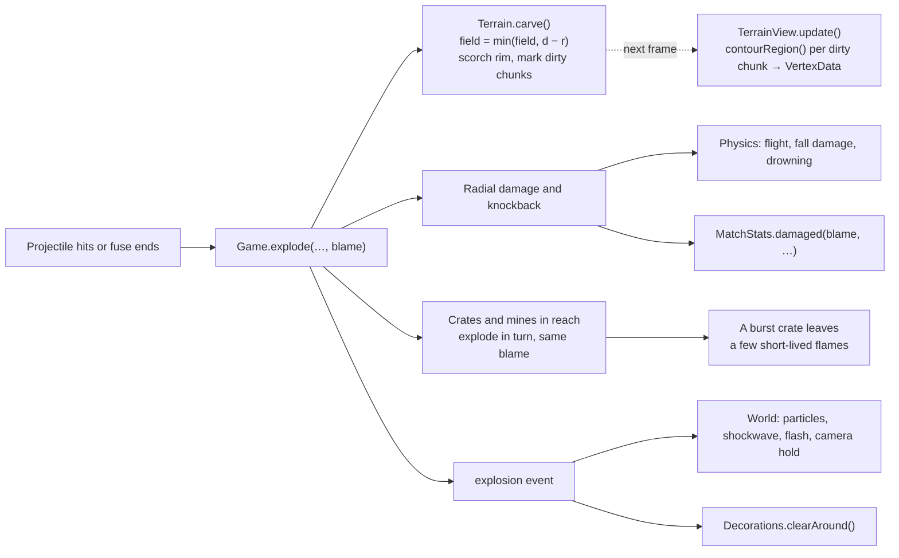
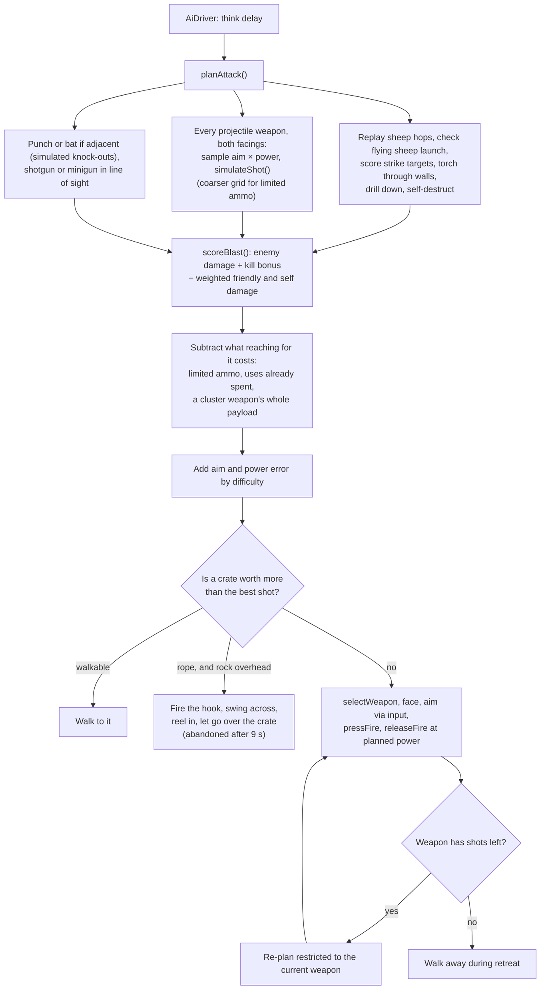
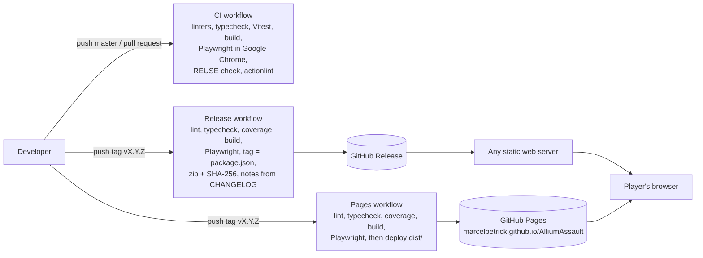

# Allium Assault — Architecture (C4)

This document describes the architecture of Allium Assault using the [C4 model](https://c4model.com/):
system context, containers, components, and the dynamic flows that matter most. Diagrams are
[Mermaid](https://mermaid.js.org/) and render directly on GitHub.

## 1. Goals and constraints

| Goal                                 | Consequence in the design                                                                              |
| ------------------------------------ | ------------------------------------------------------------------------------------------------------ |
| Looks good in 3D, no pixel/voxel art | Babylon.js scene with PBR-style lighting, shadows, post-processing; smooth meshes from a density field |
| Plays like Worms                     | Explicit match state machine, fixed 60 Hz simulation, arbitrarily destructible terrain                 |
| Browser only, no backend             | Static Vite build; all state lives in the tab (settings in `localStorage`, under a schema version)     |
| Testable                             | Rules in a headless core with no Babylon/DOM imports; `window.__allium` hook for Playwright            |
| Readable in four languages           | Every player-facing string comes from a catalogue keyed by language, with English as the fallback      |
| Answers for itself at the end        | The rules count the match as they run it, so the scoreboard credits what actually happened             |

## 2. Level 1 — System context

There is no server-side component: once the files are delivered, the game runs entirely in the
player's browser tab.

## 3. Level 2 — Containers

| Container   | Path                        | May import                                                                    |
| ----------- | --------------------------- | ----------------------------------------------------------------------------- |
| Game core   | `src/core/`                 | only other core modules and `simplex-noise` — **no Babylon, no DOM**          |
| 3D renderer | `src/render/`               | core (read-only), Babylon.js — always per module, never the package root      |
| UI overlay  | `src/ui/`                   | core types, `render/themes` and `render/quality` (both Babylon-free), the DOM |
| App shell   | `src/app.ts`, `src/main.ts` | everything                                                                    |
| Sound       | `src/audio.ts`              | Web Audio only                                                                |

Two import rules are checked rather than trusted. `tests/imports.test.ts` fails on
`from '@babylonjs/core'` anywhere in `src`, because the package root is a barrel that re-exports the
whole engine and takes the bundle from 1.5 MB to 6.9 MB; it also insists that any module building a
picking ray asks for `@babylonjs/core/Culling/ray`, the side-effect module that installs
`createPickingRay` on `Scene.prototype`. Neither mistake shows up in a typecheck.

## 4. Level 3 — Components

### 4.1 Game core

**Terrain model.** A `Float32Array` of 513 × 257 nodes (world 128 × 64 units, one node every
0.25 units). Values above zero are rock and approximate the distance to the surface, clamped to
±4. This single field serves every consumer:

- physics derives smooth collision normals from its gradient,
- explosions subtract a disc with `min(field, distance − radius)`,
- the renderer extracts the surface with marching squares.

**Match state.** `Game` is the only place that mutates match state. Input arrives as commands
(`jump`, `selectWeapon`, `pressFire`, `strike`, …) or as the held `input` flags (walking, aiming,
steering the flying sheep, swinging the flamethrower's nozzle); results leave as typed `GameEvent`s.
Besides buddies and projectiles the game owns the weapon action in progress — one `TurnAction`
(hopping or flying sheep, rope, blowtorch, drill, minigun burst, flamethrower or a panicking
self-destruct) stepped by `stepAction` — the pending strike drops, and the persistent world objects
(crates, mines, napalm flames, tombstones). Presentation of each weapon (projectile model, sounds,
muzzle flash, whether a hit brings a stadium with it) is declared in `WeaponDef.look`, so renderer
and app never switch on weapon ids.

**Attribution.** A blast carries a `Blame` — the buddy that caused it and the weapon it used —
through `explode()` and `damage()`, and through the chains a blast sets off, so a crate or a mine
touched off by somebody's grenade is still that grenade's doing. This is the one piece of knowledge
only the rules have: a `damage` event says who was hurt, never by whom. `MatchStats` books it, which
is why the scoreboard can tell a kill from an own goal and the player who earned it from the player
whose turn it happened to be.

### 4.2 Renderer and UI

## 5. Dynamic view — one frame

The simulation runs at a fixed step, independent of the frame rate. `stepFrames(n, dt)` on the
test hook swaps the real-time loop for exact frames, which is how the README GIF was recorded.

## 6. Dynamic view — turn state machine

Rules enforced here:

- ammo is consumed on a weapon's first shot,
- in `guiding`, `torching`, `drilling`, `spraying`, `roping` and `firing` the buddy cannot walk; the
  turn timer keeps running in all but `firing` (`COUNTDOWN_PHASES`), and hurting the active buddy in
  any of them ends the turn (`ACTION_PHASES`),
- `roping` is the one action phase that returns to `aiming` rather than ending the turn: the rope
  moves the buddy instead of attacking with it, so once it lands it may still take its shot — and
  the rope is only charged for once its hook actually bites,
- `spraying` still reads the up and down keys, because steering the nozzle mid-burst is the whole
  point of the flamethrower; the nozzle swings past the limits the ordinary aim is held to,
- the active buddy takes no fall damage while drilling,
- crates teleport in at turn starts from a seeded stream, so maps replay identically — one per turn
  by chance, or a fixed number under "Cratyness",
- a mystery crate's contents are rolled from that same stream when somebody opens it, not when it
  drops, so nothing about the box on the map gives the answer away and a seed still replays,
- Sudden Death raises the water one unit per turn start, never by the second, so sitting a turn out
  never floods faster than playing it,
- a buddy that dies during its own turn intro hands the turn straight on,
- the turn only ends once the world has settled — projectiles, sheep, strike drops, crates,
  napalm flames, tombstones and any mine still counting down included,
- death explosions are queued one at a time, so chain reactions resolve deterministically.

## 7. Dynamic view — an explosion

Each crate and mine is taken out of its list before its own blast, so a chain can never come back
round to it and nothing is counted twice. The blame travels with the chain: the grenade that started
it gets the credit, not the crate it happened to touch.

## 8. Dynamic view — AI turn

Planning runs on the main thread. With the full arsenal a hard decision measures about 30 ms on the
development machine — a hitch of a frame or two, once per AI turn, hidden behind the think delay.

Two things keep it from playing the same turn over and over. Reaching for a weapon costs something
before its blast is even scored: a flat charge for anything limited, a share of the weapon's whole
payload divided by how much is left, and a growing penalty for a weapon this team has already leant
on — a little even for one it can never run out of. Without that the AI found the single
highest-scoring weapon and played it until the ammo ran out, which for the concrete mule was almost
anywhere and for the Ming vase was turn one of every match. And Normal and Hard go shopping: they
already valued crates, and now reach the ones walking cannot get to by firing the rope and swinging
across. The swing is abandoned after nine seconds however it is going, because a traversal that is
not working must never eat the turn.

## 9. Deployment and delivery

Every commit on `master` carries its own SemVer version in `package.json` and a `CHANGELOG.md`
entry; only releases get a `vX.Y.Z` tag. See the Versioning section of the README and `AGENTS.md`.

All three workflows run the browser suite, the release one included: a tag cannot publish a build
that the only gate watching the renderer actually run has not seen. The release also refuses to
publish unless the tag matches the version in `package.json`.

## 10. Key decisions

| Decision                                    | Alternatives considered                | Why                                                                                                                     |
| ------------------------------------------- | -------------------------------------- | ----------------------------------------------------------------------------------------------------------------------- |
| Custom density-field terrain and physics    | Physics engines (Havok, Box2D, Planck) | General engines handle arbitrarily destructible terrain poorly; one field keeps physics and rendering consistent        |
| Babylon.js                                  | Three.js, Phaser, Unity WebGL          | Complete engine (shadows, post-processing, particles, glow) with a small integration surface; 3D was a hard requirement |
| Gameplay on a 2D plane, rendered in 3D      | Full 3D gameplay                       | Keeps Worms-style aiming and tactics while the presentation is fully 3D                                                 |
| HTML/CSS overlay for UI                     | Babylon GUI                            | Crisp text, standard layout and styling, easy Playwright selectors                                                      |
| Events out of the core                      | Renderer polling diffs                 | Effects, sound and HUD react to exactly what happened, in order                                                         |
| Statistics counted in the core              | Replaying the event log afterwards     | Only the rules know who caused a blast; an event says who was hurt, never by whom                                       |
| Babylon imported per module                 | `from '@babylonjs/core'`               | The package root is a barrel: importing it defeats tree-shaking and quadruples the bundle. Enforced by a unit test      |
| English as the source of truth for text     | A key-per-language catalogue           | Every key exists in one place; other languages are partial and fall back, so a gap shows words rather than an id        |
| Synthesized audio                           | Sample files                           | No asset pipeline or licensing; tiny build                                                                              |
| Type-aware linting, fixes over suppressions | Plain ESLint recommended               | Catches unsafe `any`, unnecessary conditions and non-null misuse in a strict TypeScript codebase                        |
| SPDX headers + REUSE.toml                   | License notice in README only          | Machine-checkable licensing for every file; enforced in CI                                                              |

## 11. Quality and testing map

| Level      | Tooling                                                                                                    | Covers                                                                                                                                                                                                                                                                                                                                                                                                                                                                                                                   |
| ---------- | ---------------------------------------------------------------------------------------------------------- | ------------------------------------------------------------------------------------------------------------------------------------------------------------------------------------------------------------------------------------------------------------------------------------------------------------------------------------------------------------------------------------------------------------------------------------------------------------------------------------------------------------------------ |
| Unit       | Vitest (`tests/`)                                                                                          | RNG, terrain generation, craters, contouring, body and projectile physics, turns, every weapon's rules, crates and mystery boxes, flames, tombstones, hotkeys, persisted settings and their migration, the four catalogues, match statistics and the honours board, AI plans and crate-hunting, a full AI-vs-AI match, and the Babylon import rules                                                                                                                                                                      |
| End-to-end | Playwright + Google Chrome (`e2e/`)                                                                        | Title demo, a human turn with real keys, AI match to victory, custom setup, arsenal, settings persistence and Reset all, graphics budget, languages, one text scale across menu and HUD, the pinned Start button, the statistics screen, about screen, pause menu; every weapon with real keys and clicks (`weapons.spec.ts`); crates and mystery boxes, camera pan, tombstones, sceneries, audio cues, movement sounds and weapon bar (`features.spec.ts`) — sounds are checked through the synthesizer's play counters |
| Static     | TypeScript strict; ESLint (type-checked), Prettier, Stylelint, markdownlint; SPDX check, REUSE, actionlint | Whole codebase                                                                                                                                                                                                                                                                                                                                                                                                                                                                                                           |
| Coverage   | Vitest v8 over `src/core` (`npm run coverage`)                                                             | Thresholds of 98% on statements, branches, functions and lines, enforced in CI and in every release. `src/render`, `src/ui`, `src/app.ts` and `src/audio.ts` need a GPU or the DOM and are covered by the browser suite instead                                                                                                                                                                                                                                                                                          |
| Profiling  | `npm run profile` over `bench/core.bench.ts`                                                               | One fixed step of the rules core, stage by stage, checked against a tenfold ceiling so an order-of-magnitude regression fails rather than merely printing. Numbers and method in `PERFORMANCE.md`                                                                                                                                                                                                                                                                                                                        |
| Pipeline   | `npm run verify`, GitHub Actions                                                                           | All of the above on every push; releases and GitHub Pages deployment on tags, both gated on the browser suite                                                                                                                                                                                                                                                                                                                                                                                                            |
