# Every weapon, in action

Twenty-four clips, one per weapon, each filmed on a scenery of its own. They are recorded from the
game rather than staged: `scripts/capture-weapons.mjs` drives a real match through the same test
hook the browser suite uses, with a fixed seed and a fixed frame step, so re-running the script
produces the same film. Nothing here is a mock-up.

Each clip opens on the buddy holding the weapon, then fires it. What you see under the arena is the
real weapon bar, with the weapon of the moment lit up.

To record them again:

```bash
npm run build
npm run preview                      # in another terminal
npm run capture-weapons              # all twenty-four
npm run capture-weapons -- http://localhost:4173 ming flamer    # or just these
```

The numbers each weapon does are in the [README's weapon table](../README.md#weapons); this page is
for watching them.

## The clips

### 🚀 Bazooka

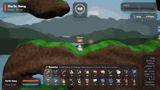

**1** · unlimited · Meadow

Hold Space to charge. Wind pushes it hard. Boom on contact.

### 💣 Grenade

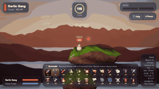

**2** · unlimited · Sunset

Bouncy throw with a 3 second fuse. Barely cares about wind.

### 🧨 Cluster Bomb

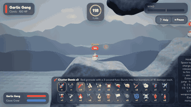

**3** · 3 per match · Frost

Red grenade with a 3 second fuse. Bursts into five bomblets of 10 damage each.

### 🍌 Banana Bomb

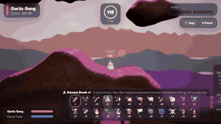

**4** · 1 per match · Candy

3 second fuse, then five explosive bananas bounce everywhere and go off one by one.

### ✨ Holy Garlic Grenade

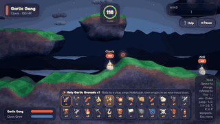

**5** · 1 per match · Night

Rolls to a stop, sings Hallelujah, then erupts in an enormous blast.

### 💥 Shotgun

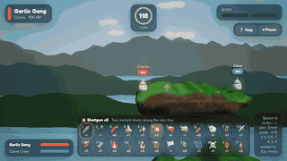

**6** · 2 per match · Meadow

Two instant shots along the aim line.

### 🔫 Minigun

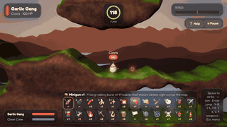

**7** · 1 per match · Sunset

A long rattling burst of 14 bullets that shoves victims right across the map.

### 👊 Garlic Punch

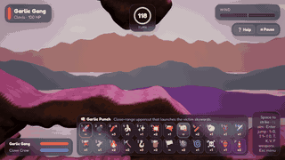

**8** · unlimited · Candy

Close-range uppercut that launches the victim skywards.

### 🏏 Baseball Bat

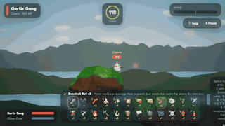

**9** · 2 per match · Meadow

Home run! Less damage than a punch, but swats the victim far along the aim line.

### 🐑 Sheep

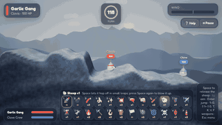

**0** · 1 per match · Frost

Space lets it hop off in small leaps; press Space again to blow it up.

### 🦸 Flying Sheep

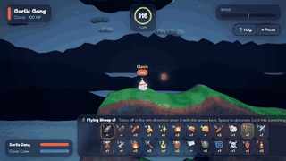

**⇧1** · 1 per match · Night

Takes off in the aim direction; steer it with the arrow keys, Space to detonate (or it hits something).

### ✈️ Air Strike

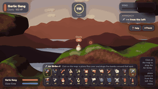

**⇧2** · 1 per match · Sunset

Click on the map: a plane flies over and drops five bombs around that spot.

### 🌋 Napalm Strike

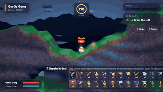

**⇧3** · 1 per match · Night

Click on the map: a plane drops napalm that the wind carries far; the ground burns for about nine seconds, eating into it.

### 🫏 Concrete Mule

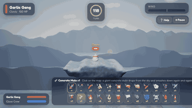

**⇧4** · 1 per match · Frost

Click on the map: a giant concrete mule drops from the sky and smashes down again and again.

### 🔥 Blowtorch

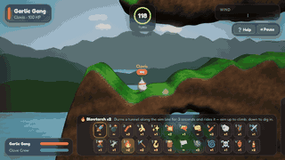

**⇧5** · 2 per match · Meadow

Burns a tunnel along the aim line for 3 seconds and rides it — aim up to climb, down to dig in.

### ⛏️ Drill

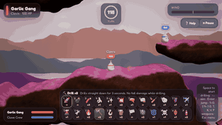

**⇧6** · 2 per match · Candy

Drills straight down for 3 seconds. No fall damage while drilling.

### 🪝 Rope

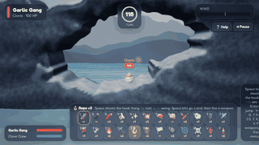

**⇧7** · 3 per match · Frost

Space shoots the hook; hang, ↑↓ reel, ←→ swing, Space lets go. Land, then fire a weapon.

### 🪵 Platform

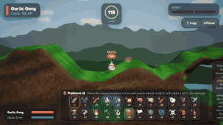

**⇧8** · 2 per match · Meadow

Move the mouse to place a five-unit board, wheel to tilt it, left-click to set it. No damage.

### 🏳️ French Attack

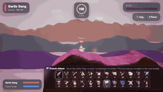

**⇧9** · unlimited · Candy

Wave the white flag: no shot, no damage, no crater. The turn passes straight to the next buddy.

### 🛞 Proximity Mine

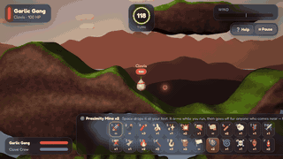

**⇧0** · 2 per match · Sunset

Space drops it at your feet. It arms while you run, then goes off for anyone who comes near — friend or foe.

### 🌀 Teleport

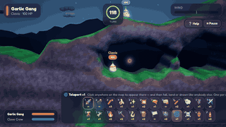

**T** · 1 per match · Night

Click anywhere on the map to appear there — and then fall, land or drown like anybody else. One per match.

### ☠️ Self-Destruct

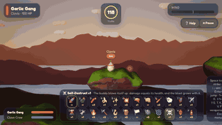

**K** · 1 per match · Sunset

The buddy blows itself up: damage equals its health, and the blast grows with it.

### 🏺 Ming Vase

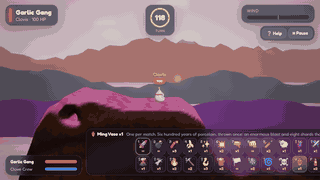

**V** · 1 per match · Candy

One per match. Six hundred years of porcelain, thrown once: an enormous blast and eight shards that each hit like a grenade.

### 🧯 Flamethrower

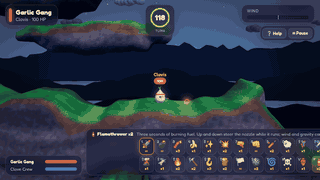

**F** · 2 per match · Night

Three seconds of burning fuel. Up and down steer the nozzle while it runs; wind and gravity carry the gobs, and where they land they keep burning.

## A note on the file sizes

Each clip is 320 pixels wide, ten frames a second, 48 colours — about 400 kB. That is small enough
that twenty-four of them fit in a repository somebody has to clone, and large enough to see what is
going on. The settings live at the top of `scripts/capture-weapons.mjs` if you want them bigger.
